# StuArt

**Title:** *StuArt: Individualized Classroom Observation of Students with Automatic Behavior Recognition and Tracking*

* **Figure 2**

**Top:** examples of K-12 classroom scenarios. **Bottom:** some samples of annotated behaviors.

<table>
<tr>
<th>A</th>
<th>B</th>
<th>C</th>
<th>D</th>
</tr>
<tr>
<td>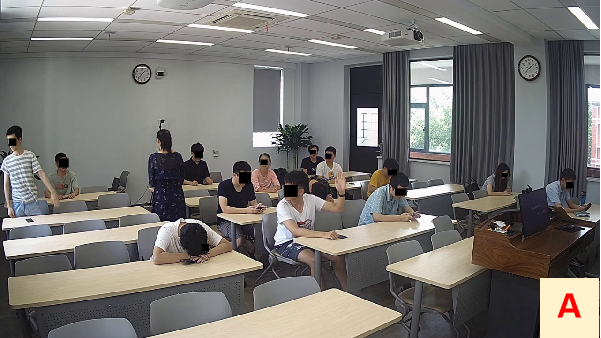</td>
<td>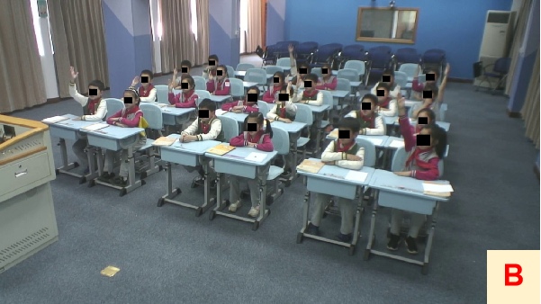</td> 
<td>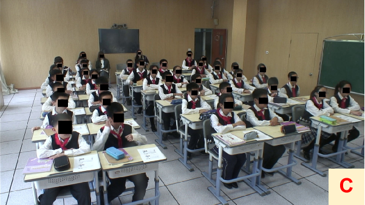</td>
<td>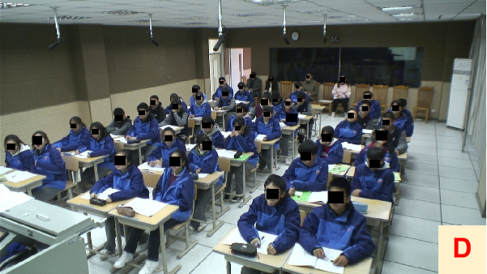</td> 
</tr>
</table>

<table>
<tr>
<th>Handraising</th>
<th>Standing</th>
<th>Sleeping</th>
<th>Yawning</th>
<th>Smiling</th>
</tr>
<tr>
<td>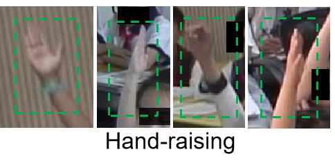</td>
<td>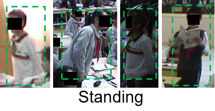</td> 
<td>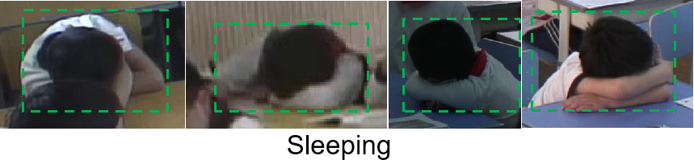</td>
<td></td> 
<td></td> 
</tr>
</table>

* **Figure 3**

Qualitative behavior detection results. Yellow, green, cyan, red, blue and black boxes are hand-raisings, standing, sleeping, yawning, smiling and teacher, respectively.

<table>
<tr>
<th>1</th>
<th>2</th>
<th>3</th>
</tr>
<tr>
<td>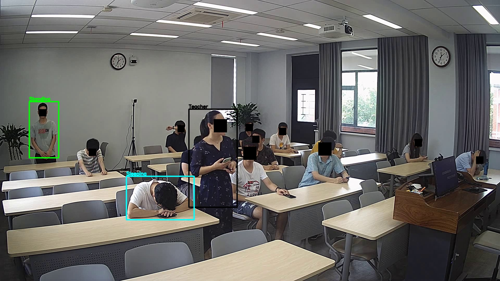</td>
<td>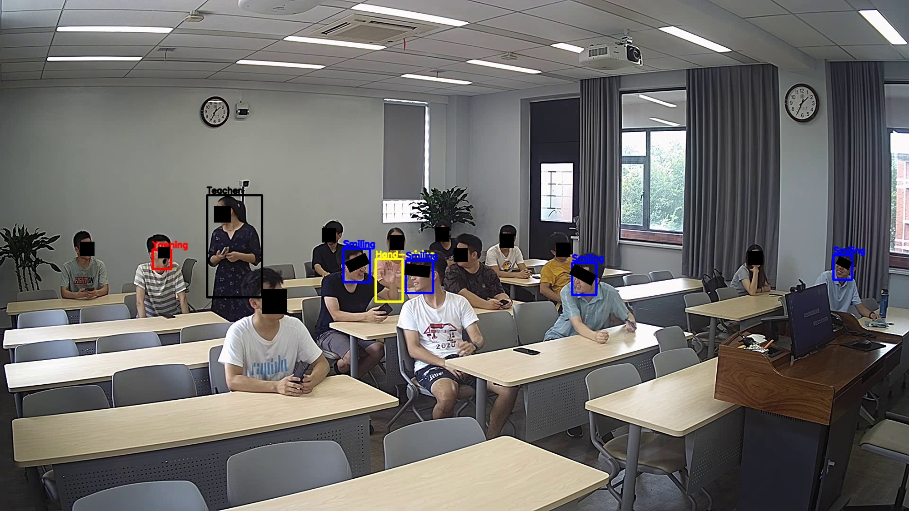</td> 
<td>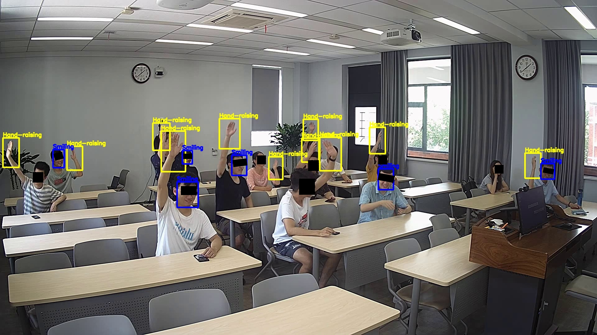</td>
</tr>
</table>

* **Figure 5**

**Left:** visualizations of two non-interactive designs. The current data corresponds to the frame shown in Figure 4 top. **Right:** visualizations of two non-interactive designs.

<table>
<tr>
<th>SeatTable</th>
<th>LinkList</th>
</tr>
<tr>
<td>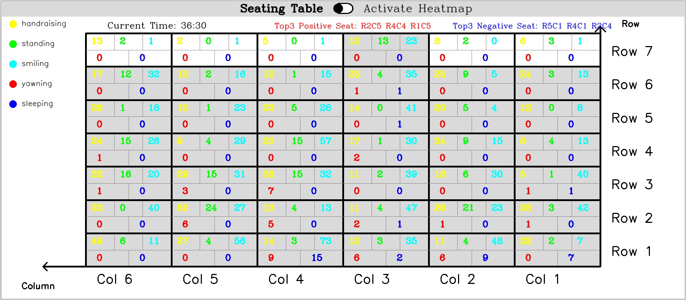</td>
<td>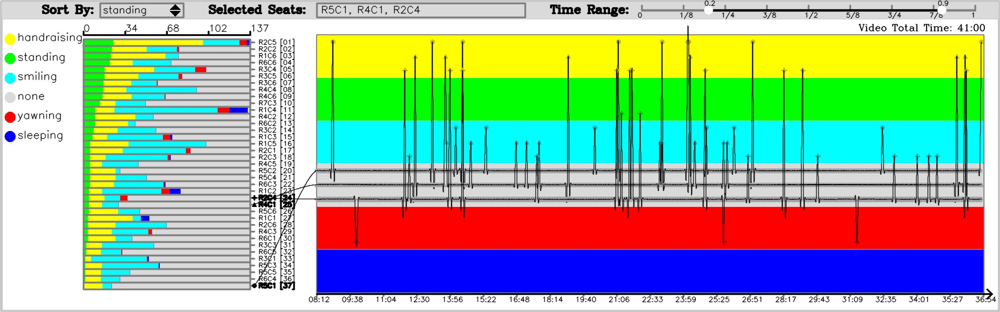</td> 
</tr>
<tr>
<th>ActivateHeatmap</th>
<th>PointFlow</th>
</tr>
<tr>
<td>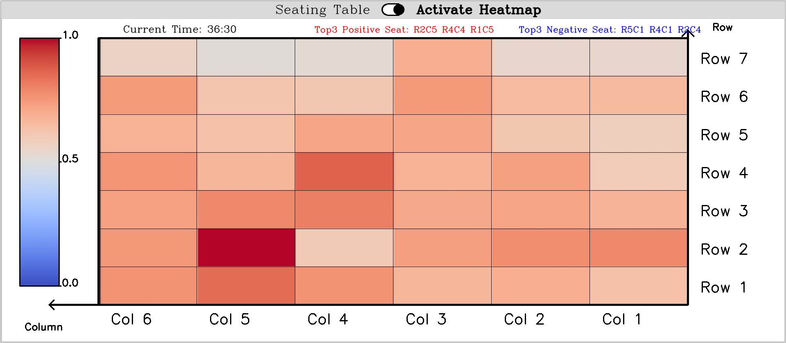</td>
<td>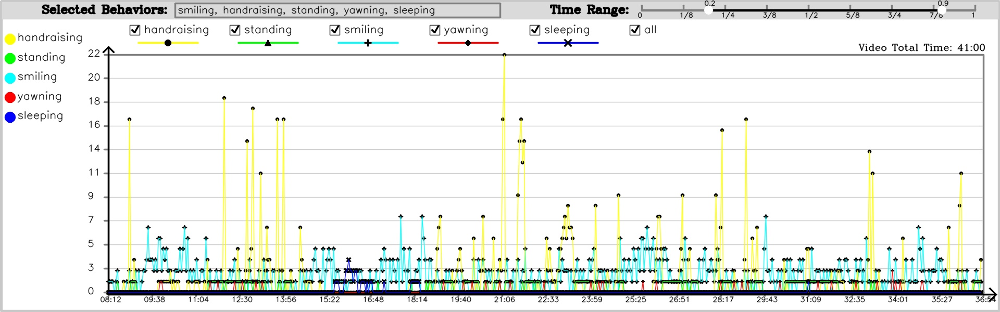</td> 
</tr>
</table>

